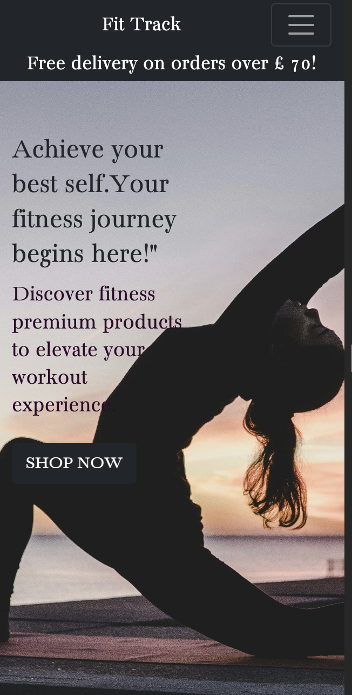

# Fit Track

Fit Track is my forth milestone project for Code Institute Level 5 Diploma in Web Application Development.

Fit Track is an e-commerce platform tailored for enthusiasts of Pilates and Running activities. Here, users can explore a diverse range of clothing, footwear, and accessories designed specifically for these pursuits. The platform offers intuitive navigation through various categories and employs sorting filters like name and category for seamless browsing. Additionally, users can employ keyword searches to swiftly locate desired items.

Functionality-wise, Fit Track provides essential features such as product purchasing, user account creation, login/logout mechanisms, and a convenient contact option for reaching out to the website owner with inquiries. Furthermore, users have the opportunity to leave reviews for purchased products, complete with a rating system ranging from 1 to 5. These reviews are made publicly available, contributing to the community's knowledge and aiding others in their purchasing decisions.

The website is live and the link can be fund [Here](https://fit-track-0314c0bbcc52.herokuapp.com/)
 

## `Table of Contents`

## [UX](#ux "UX")
  + [Site Goals](#site-goals "Site Goals")
  + [Visitors Goals](#visitors-goals "Visitor Goals")
  + [Audience](#audience "Audience")
 ## [Design](#design "Design")
  + [Colour scheme](#colourscheme "Colour scheme")
  + [Typography](#typography "Typography")
  + [Imagery](#imagery "Imagery") 
 ## [Features](#features "Features")
 + [Existing Features](#existing-features "Existing Features")
 + [Future Features](#future-features "Future Features")
## [Testing](#testing "Testing")
## [Technologies Used](#technologies-used "Technologies Used")
  + [ Languages Used](#languages-used " Languages Used")
  + [Frameworks, Programs Used](#frameworks-programs-used "Frameworks, Programs Used")
## [Deployment and Local Development](#deployment-and-local-development "Deployment and Local Development")
## [Credits](#credits "Credits")
 

# `UX`

## `Site Goals:` 

The goal of the Fi Track website is to establish a smooth e-commerce platform, enabling users to effortlessly navigate products, add them to their carts, finalize purchases, receive email order confirmations, and access detailed records of their past orders. Moreover, users can also contribute product reviews and reach out to the owner with inquiries directly through the website.

## `Visitors Goals:` 

## User Stories

## Viewing and Navigation

| As a...  | I want to be able to…                             | So that I can…                                              |
|----------|---------------------------------------------------|-------------------------------------------------------------|
| Shopper  | Quickly understand the purpose of the site        | Determine its relevance to my interests                     |
| Shopper  | Browse a list of products                         | Select items for purchase                                    |
| Shopper  | Access detailed product information               | Make informed purchase decisions based on various factors    |
| Shopper  | Easily spot new products and special offers       | Take advantage of discounts and promotions                  |
| Shopper  | Monitor my total purchases easily                 | Manage my budget efficiently                                |
| Shopper  | Read reviews from past customers                  | Inform my purchase decisions based on others' experiences   |

## Registration and User Accounts

| As a...          | I want to be able to…                             | So that I can…                                              |
|------------------|---------------------------------------------------|-------------------------------------------------------------|
| Registered User  | Register for an account effortlessly              | Access personalized features and view my profile            |
| Registered User  | Conveniently log in or log out                    | Access and manage my account information easily             |
| Registered User  | Recover my password easily if forgotten           | Regain access to my account if locked out                   |
| Registered User  | Receive email confirmation upon registration       | Confirm successful account creation                         |
| Registered User  | Have a personalized user profile                  | View order history, save payment information securely       |
| Registered User  | Verify my email address for security purposes      | Ensure data safety and integrity                            |
| Registered User  | Access my past reviews easily                      | Recall my opinions on products for future purchases         |

## Sorting and Searching

| As a...  | I want to be able to…                             | So that I can…                                              |
|----------|---------------------------------------------------|-------------------------------------------------------------|
| Shopper  | Sort products by various criteria                  | Identify top-rated, best-priced, and categorized items easily |
| Shopper  | Sort products within a specific category           | Find the best options within a specific product category   |
| Shopper  | Search for products by name or description         | Locate specific items quickly and efficiently               |
| Shopper  | Save billing and shipping details for future orders | Expedite checkout for subsequent purchases                  |
| Shopper  | Leave reviews and feedback on products             | Assist other shoppers in making informed decisions          |
| Shopper  | Edit or update my reviews                          | Reflect changes in my opinions or product experiences       |
| Shopper  | Delete my reviews if necessary                     | Maintain accurate and relevant product feedback             |

## Purchasing and Checkout

| As a...  | I want to be able to…                             | So that I can…                                              |
|----------|---------------------------------------------------|-------------------------------------------------------------|
| Shopper  | Easily select product size and quantity            | Avoid errors in product selection and ordering              |
| Shopper  | Review items in my shopping bag                    | Confirm contents and total cost before proceeding to checkout |
| Shopper  | View total cost before finalizing purchase        | Ensure transparency and avoid surprises in pricing          |
| Shopper  | Adjust item quantities in my shopping bag          | Make last-minute changes or additions to my order           |
| Shopper  | Input payment information easily                   | Complete checkout swiftly and securely                      |
| Shopper  | Trust in the security of my personal and payment information | Feel confident in providing necessary details for purchase |
| Shopper  | Receive an order confirmation at checkout          | Verify accuracy and completeness of my order                |
| Shopper  | Receive email confirmation post-checkout          | Keep a record of my purchase for reference                  |
| Shopper  | Easily contact customer support for inquiries       | Obtain assistance or clarification as needed                |
| Shopper  | Check for free shipping eligibility                | Optimize value and savings on larger purchases               |
| Shopper  | Checkout without registering for an account        | Proceed with purchase smoothly, even without account registration |

## Admin and Store Management

| As a Store Owner | I want to be able to…                 | So that I can…                                         |
|-------------------|---------------------------------------|--------------------------------------------------------|
| Store Owner      | Add a product                         | Add new items to my store                              |
| Store Owner      | Edit/Update a product                 | Modify product prices, descriptions, images, and other criteria |
| Store Owner      | Delete a product                     | Remove items that are no longer for sale               |
| Store Owner      | Change a price                       | Adjust product prices, including special offers        |

## `Audience:` 

The Fit Track e-commerce website caters to both Pilates and running enthusiasts, welcoming individuals of all ages.

# `Design`

## `Colour scheme:` 

The main color scheme utilizes a blend of black, grey, and white to create a striking contrast. Vibrant hues like deep purple are reserved for links and headers, adding emphasis. Strategic splashes of blue and red adorn buttons for actions like editing and deleting reviews, while blue tags denote new items and red tags highlight special prices. This thoughtful use of color ensures key elements catch the eye and engage users effectively.

## `Typography:`
 Bacasime has been used for entire body.
The icons used  for social media links are from [Font Awesome.](https://fontawesome.com/)
 

## `Imagery:`

The main image on the website is sourced from  [Unsplash](https://unsplash.com), while the product images are obtained from [Freepik.](https://www.freepik.com)

 

# `Existing Features`

All pages are fully responsive across all screen sizes.

## Homepage

| Desktop View                               | Mobile View                                |
|--------------------------------------------|--------------------------------------------|
|       |      |

 
* The homepage warmly greets visitors with an image of a woman engaged in outdoor stretching exercises. This image resonates with activities like Pilates and outdoor running, inviting users to explore various fitness avenues.
* A prominent "Shop now" button encourages users to browse the website and discover the products available for purchase.

## Navigation bar

| Desktop View                               | Mobile View                                |Mobile View                                |
|--------------------------------------------|--------------------------------------------|--------------------------------------------|
|     |      |      |

* The website offers an intuitive and easily navigable experience, featuring a top navigation bar on larger screens and a side  navigation menu on smaller screens. These menus dynamically adjust based on user status, distinguishing between logged-in users, super users, and whether items are in their shopping bag.
* A convenient search function empowers customers to find specific products effortlessly.
* Furthermore, a prominent label advertising free delivery discounts encourages customers to explore the website further.

| Non-user navigation view                               | User navigation view                              |Super user navigation view                              |
|--------------------------------------------|--------------------------------------------|--------------------------------------------|
|     |      |  |

* For first-time visitors, the navigation view remains largely consistent, with the exception of the "Account" link, which offers options to register or sign in, depending on their preference.
* Account holders have access to their personalized profile page, where they can conveniently store their delivery information and review their order and review history.
* Super users, including administrators and store owners, possess additional capabilities in product management. This includes the ability to add, edit, or delete products as needed.

## Sign up page

| Desktop View                               | Mobile View                                |
|--------------------------------------------|--------------------------------------------|
|       |      |

* The sign-up form prompts users who already have an account to sign in instead, providing both a text link  them to the login page.
* The Sign-Up form requests users to input their email address, ensuring its uniqueness to their account. Additionally, users are prompted to select a username, which must also be unique to their account.
* Following that, the form prompts users to set a password, confirm it, and then proceed by clicking the "Sign Up" button. All fields on the Sign-Up form are mandatory, ensuring users complete them before advancing to sign up.

## Sign in page

| Desktop View                               | Mobile View                                |
|--------------------------------------------|--------------------------------------------|
|       |      |

* The Sign  page enables registered users to access their existing accounts by logging in.
* The Sign-In page encourages users without an account to register first before attempting to log in, offering a text link to the Sign-Up page.
* The Login form prompts users to input either their username or email, along with their password. If an incorrect username or password combination is entered, an error message displays stating, "The username and/or password you specified are not correct."
* A radio button labeled "Remember me" provides users with the option to choose whether they want their login information to be saved for their next visit to the site.

## Password reset page

| Desktop View                               | Mobile View                                |
|--------------------------------------------|--------------------------------------------|
|       |      |

* Django provides built-in password reset functionality, allowing users to click a link if they forgot their password. This directs them to a page where they can enter their email address. An email containing a link to reset their password is then sent to the specified email address.

## All product page

| Desktop View                               | Mobile View                                |
|--------------------------------------------|--------------------------------------------|
|       |      |

* The All Products view page displays all available products for sale, enabling users to browse through the entire selection. Users can filter products by category and sort them by price, alphabetized name, or alphabetized category, enhancing their browsing experience.
* Selecting any category button redirects the user to a page showcasing only products matching their selection. Additionally, the 'Sort by...' box provides users with the option to arrange products from low to high based on price.
* On the All Products page, products are presented in cards featuring the product image, title, price, rating and category tag.  For superusers, there are additional edit and delete links provided for product stock control.
* Badges are placed on products to provide instant feedback to users regarding whether a product is new or on special price.

## Product detail page

| Desktop View                               | Mobile View                                |
|--------------------------------------------|--------------------------------------------|
|       |      |

* Users access the Product Detail page by clicking on the title or image of a product from the All Products page.
* The Product Detail page presents the product image, title, price, tags, full description, and availability of any reviews for the product.
* Users can select the size and quantity of the product and add it to their bag by clicking the "Add to Bag" button. Alternatively, they can choose to continue shopping by clicking the "Keep Shopping" button, which redirects them to the All Products page.
* Furthermore, the page displays any reviews previously left for the product and provides registered users with the option to leave their own reviews.

## Review form page

| Desktop View                               | Mobile View                                |
|--------------------------------------------|--------------------------------------------|
|       |      |

* Users can access the Review form page from the Product Detail page by clicking on the provided link located above the review messages.
* Users can select a rating from 1 to 5 and provide a brief comment about their experience on the Review form page.
* After the user writes a message, they submit the review by clicking on the button, which then redirects them to the product page with their review displayed.
* Additionally, there is a "Cancel" button available in case the user changes their mind about leaving a review.

## Profile page

| Desktop View                               | Mobile View                                |
|--------------------------------------------|--------------------------------------------|
|       |      |

* A user profile page provides users with the capability to view and update their default delivery information.
* There is an order history section that allows users to review details of all their past orders.
* Furthermore, there is a reviews section that grants users the ability to view their past reviews and offers options to edit or delete them.

## Bag page

| Desktop View                               | Mobile View                                |
|--------------------------------------------|--------------------------------------------|
|       |      |

* To access the Shopping Bag view, users click on the bag icon in the navbar. This page displays the current contents of the bag, including product information.
* If the bag is empty, a message stating 'Your bag is empty' will be displayed, accompanied by a button encouraging users to continue shopping.
* The quantity of selected products can be adjusted using the quantity input field, which automatically updates the subtotal. 
* Additionally, users can remove items from the bag using the red remove link.
* Further down the page, the bag total is displayed along with the delivery cost and grand total. Additionally, a message indicates how much more the user would need to spend to qualify for free delivery.
* From this point, users can either click 'Keep Shopping' to return to the products page or click 'Secure Checkout' to proceed to the checkout page.

## Checkout page

| Desktop View                               | Mobile View                                |
|--------------------------------------------|--------------------------------------------|
|       |      |

* The checkout page initially presents an order summary before prompting users to fill out the necessary details, including delivery and payment information, to complete their order.
* The checkout form includes fields for Full Name, Email Address, Phone Number, Street Address, Town or City, Post Code and country.
* There is a radio button available for users to choose whether to save this delivery information to their profile, provided they are logged in. If a user has previously opted to save information to their profile, this form will be auto-populated accordingly.
* At the bottom of the form, users can enter their card details in the payment field. Additionally, there is a button that allows users to either redirect back to their bag or proceed to complete their order. Stripe validates their details during the order completion process.
* Underneath the 'Complete Order' button, a message displayed warns users that their card is about to be charged and indicates the amount.
* To successfully process the order, all required fields of the form must be filled in before the 'Complete Order' button can be clicked.
* After successful payment processing, users will be redirected to the order confirmation form.

## Order confirmation page

| Desktop View                               | Email view                               |
|--------------------------------------------|--------------------------------------------|
|       |      |

* The page confirms that the order has been successfully processed and informs the user of the email address to which their confirmation will be sent.
* The same confirmation will be sent to the email address indicated in the form.
* On the order success page, users can review the order number, order date, the items ordered with their quantities, the full delivery details provided, and the complete billing information.
* Below this information, a button encourages users to 'Continue Shopping,' redirecting them to the All Products page.

## Contact us page

| Desktop View                               | Email view                               |
|--------------------------------------------|--------------------------------------------|
|       |      |

* The Contact form is accessible whether a user is logged in or not via the "Contact" icon in the navigation bar.
* The form prompts users to fill in their name, email, subject line, and message. Below the form, a button is provided to allow users to submit their message.
* The contact form is configured to send a confirmation email to the user, containing their message subject and content, repeated back to them for their records.

## Success & alter messages 

| Success                             | Alter                              | 
|--------------------------------------------|--------------------------------------------|
|       |      |

* Various messages appear in the right corner, depending on the context of the message. These messages could signify success, alert, or warning.

# `Future Features`

Given additional time, there are several features I would like to implement to enhance the project's functionality and user experience:

* Implement a wishlist feature for users to save their favorite products.
* Introduce a feature allowing users to request email notifications when their favorite products are back in stock.
* Incorporate a stock availability feature to display the remaining stock of an item to users.
* Develop a stock count feature that notifies site managers and admins via email when the stock of an item is running low.

# `Testing`

