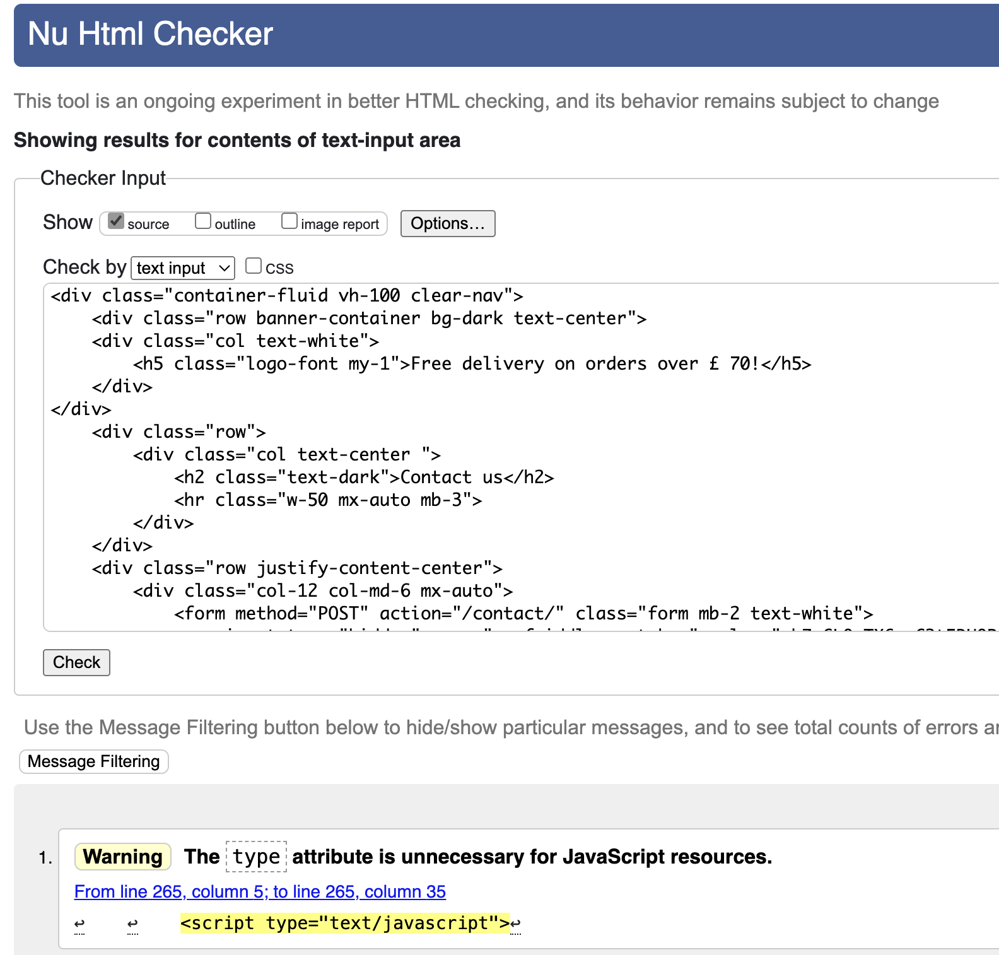
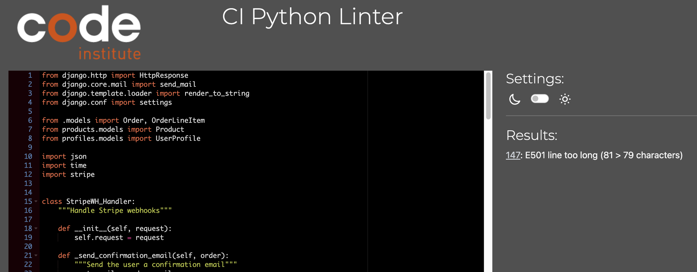

# Testing documentation for Fit Track website.
 

# Contents

* [Validation](#validation)
    * [HTML Validation](#html-validation)
    * [CSS Validation](#css-validation)
    * [JS Validation](#js-validation)
    * [CI Python Linter](#ci-python-linter)
    * [Lighthouse](#lighthouse)
* [User Story Testing](#user-story-testing)
    * [General](#general)
    * [Logged Out](#logged-out)
    * [User Logged In](#user-logged-in)
* [Manual Testing](#manual-testing)
* [Responsiveness](#responsiveness)
* [Fixed Bugs](#fixed-bugs)
* [Unfixed Bugs](#unfixed-bugs)

  

# Validation

## HTML Validation

* All pages successfully passed the HTML validator check, except for a warning regarding a duplicate ID, dropdownMenuButton2. I have resolved this by updating the IDs to dropdownMenuButton1, dropdownMenuButton2, dropdownMenuButton3, and dropdownMenuButton4 respectively. This change eliminated the warning, and now all pages are error-free according to the HTML validator.

* On the contact page, an error was indicated concerning the for attribute of a label, which should specify the ID of a form control that the label is associated with. To address this, I made modifications to the contact form to rectify the error.

Homepage

 

 Sign in page 

 

 My profile page 

 

 Add product page 

 

 Bag page 

 

 Check out page 

 

All Products page 

 

Product detail page 

 

 Contact page 

 

 

## CSS Validation

* CSS files passed W3C validator with no errors.

 Bace css 

 

 Checkout css 

 

 Product css 

 

 Profile css 

 

 

## JS Validation

* The JS file passed the test with two warnings. It can be ignored as code works as expected.

 Stripe js file 

 

 

## CI Python Linter

 Bag Contexts.py  

 

 Bag url.py  

 

 Bag views.py  

 

 Checkout admin.py  

 

 Checkout forms.py  

 

 Checkout models.py  

 

 Checkout views.py  

 

 Checkout webhook_handler.py  

 

 Checkout webhooks.py  

 

 Contact forms.py  

 

 Contact models.py  

 

 Contact views.py  

 

 

## Manual Testing

### Navigation bar and Homepage

| Feature/Action                                       | Expected Outcome                                                  | Result  |
|------------------------------------------------------|-------------------------------------------------------------------|---------|
| Shop button redirects to All products page          | Clicking on Shop button navigates to All products page            | Pass    |
| Logo takes you back to the home page                | Clicking on the logo navigates to the home page                   | Pass    |
| Search bar works and loads correct results          | Entering a search query displays relevant results                 | Pass    |
| Navigation to product categories                    | Clicking on category links navigates to correct product pages     | Pass    |
| Account dropdown and links functionality            | Dropdown displays options, links navigate to correct pages        | Pass    |
| Bag button functionality                            | Clicking on bag button navigates to bag page                      | Pass    |
| Dynamic bag button update                           | Bag button updates dynamically when items are added               | Pass    |
| Contact button launches contact form                | Clicking on contact button opens contact form                     | Pass    |
| Responsive navbar collapse                         | Navbar collapses into mobile menu on smaller screens              | Pass    |
| Badge display for shopping bag                      | Badge appears over navbar toggler when bag has items              | Pass    |
| Mobile navigation behavior identical to full navbar | Mobile navigation links behave the same as full navbar            | Pass    |
| Sidenav collapses correctly                        | Side navigation collapses on close button or outside navigation   | Pass    |

### Products page

| Feature/Action                                    | Expected Outcome                                         | Result  |
|---------------------------------------------------|----------------------------------------------------------|---------|
| All product images and links clickable           | Clicking on product images or links navigates correctly | Pass    |
| Sort function sorts products correctly           | Products are sorted as per selected criteria            | Pass    |
| All images are rendered correctly                | Images are displayed without any distortion or errors   | Pass    |
| Clickable new and special price badges          | Badges lead to respective pages when clicked            | Pass    |
| Clickable product tags                           | Tags redirect to relevant pages upon clicking           | Pass    |

### Products detail page

| Feature/Action                                        | Expected Outcome                                                       | Result  |
|-------------------------------------------------------|------------------------------------------------------------------------|---------|
| Product image opens full-size in new tab on click     | Clicking on the product image opens it in a new tab at full size      | Pass    |
| Quantity selector buttons function correctly          | Buttons correctly adjust quantity within the range of 1-99             | Pass    |
| Size selector dropdown updates price dynamically      | Changing size dynamically updates the product price accordingly         | Pass    |
| Review carousel buttons cycle through reviews         | Buttons allow cycling through reviews without issues                   | Pass    |
| Add review link launches modal and submits review   | Modal opens when clicked, and submitted review is visible on the page  | Pass    |
| Items added to shopping bag with correct message      | Successful addition to bag displays correct success message            | Pass    |
| "Keep shopping" button redirects to products page     | Clicking on the button navigates back to the products page             | Pass    |
| Clickable product tags                           | Tags redirect to relevant pages upon clicking           | Pass    |

###  Product Management page

| Feature/Action                    | Expected Outcome                                 | Result  |
|-----------------------------------|--------------------------------------------------|---------|
| Selecting product management      | Redirects to Add product form                    | Pass    |
| Category dropdown                 | Displays all available product categories        | Pass    |
| Select box for new or on sale     | Applies correct badge based on selection        | Pass    |
| Select Image button               | Loads the selected image correctly               | Pass    |
| Add product button                | Adds product to the database and returns to management page | Pass    |
| Cancel button                     | Redirects to products page                       | Pass    |

### User Profile Page

| Feature/Action                                               | Expected Outcome                                                                | Result  |
|--------------------------------------------------------------|---------------------------------------------------------------------------------|---------|
| Default delivery info populated from saved data              | Delivery information is pre-filled with previously saved data, if available     | Pass    |
| Update information button                   | The button works and update the information accordigly              | Pass    |
| Order history displays past orders with clickable links      | Past orders are listed, and clicking on the order number leads to order details  | Pass    |
| Reviews section shows all past reviews                       | All past reviews left by the customer are displayed                               | Pass    |
| Edit review functionality                                    | Clicking on edit review launches the edit review form                             | Pass    |
| Edit review form validation and database update              | Edit review form validates input and updates the review in the database           | Pass    |
| Delete review  button                           | Delete review button deletes the review from the database       | Pass    |

## Shopping bag page

| Feature/Action                                      | Expected Outcome                                                   | Result  |
|-----------------------------------------------------|--------------------------------------------------------------------|---------|
| Quantity selector within range and functional       | Selector buttons work within the range of 1-99                    | Pass    |
| Update link updates bag item quantity               | Clicking update link correctly updates the bag item quantity       | Pass    |
| Remove link removes product from bag                | Clicking remove link removes the product from the bag              | Pass    |
| Subtotal updates dynamically after bag changes      | Subtotal value updates automatically after bag changes             | Pass    |
| Bag totals update correctly on bag changes          | Bag total, delivery, and grand total update correctly on changes   | Pass    |
| "Keep shopping" button redirects to products page   | Button navigates back to the products page when clicked            | Pass    |
| "Checkout" button redirects to checkout page        | Clicking on the checkout button redirects to the checkout page     | Pass    |

###  Contact page

| Feature/Action                                      | Expected Outcome                                                           | Result  |
|-----------------------------------------------------|----------------------------------------------------------------------------|---------|
| Contact form submission                            | Form submission successfully sends message to the store                     | Pass    |
| Confirmation emails sent                          | Both customer and store receive confirmation emails after form submission   | Pass    |
| Form validation in contact form  | Validate input fields before submission      | Pass    |
| Cancel button         | Redirects to homepage        | Pass    |

## Checkout and checkout success pages

| Feature/Action                                      | Expected Outcome                                                       | Result  |
|-----------------------------------------------------|------------------------------------------------------------------------|---------|
| Pre-filled delivery details                         | Delivery details are pre-filled if previously saved                    | Pass    |
| Correct display of order details and line items     | Accurate display of order details and line items                       | Pass    |
| Clickable product image                             | Clicking on the image redirects to the product details page            | Pass    |
| Accurate calculation of order totals                | Order total, delivery, discount, and grand total are correct           | Pass    |
| Form validation for input fields                    | Input fields, such as email format, are validated correctly            | Pass    |
| Card validation and error messages                  | Error messages display correctly upon failed card validation           | Pass    |
| "Adjust bag" button functionality                   | Button returns user to the bag page as expected                        | Pass    |
| "Complete order" button functionality               | Order processing redirects user to checkout success page on success    | Pass    |
| Correct display of order details                    | Order details are displayed accurately  on order success page                                | Pass    |
| Success message upon order completion               | User receives a success message confirming the order was successful    | Pass    |
| Order confirmation email sent to the user           | User receives an order confirmation email                               | Pass    |
| "Checkout our latest deals" button functionality    | Button redirects user to the all specials page                          | Pass    |

## Register page

| Feature/Action                                      | Expected Outcome                                                       | Result  |
|-----------------------------------------------------|------------------------------------------------------------------------|---------|
| Form validation for email and password fields      | Validates email and password fields to ensure correctness              | Pass    |
| Matching emails and passwords                       | Ensures that entered emails and passwords match                         | Pass    |
| Password strength validation                        | Verifies that the password is not too weak                              | Pass    |
| Non-existence of user with entered details          | Checks that no user with the provided details already exists           | Pass    |
| Sign up button functionality                        | Creates an account and sends a confirmation email for verification      | Pass    |

## Sign In page

| Feature/Action                                      | Expected Outcome                                                       | Result  |
|-----------------------------------------------------|------------------------------------------------------------------------|---------|
| Sign in button functionality                       | Redirects the user to the home page upon successful sign in             | Pass    |
| Take me home button functionality                  | Redirects the user back to the home page                                 | Pass    |
| Forgot password link                                 | Redirects to forgot password page                                | Pass    |
| Sign up link                                         | Redirects to sign up page                                | Pass    |

## Sign Out page

| Feature/Action                                      | Expected Outcome                                                       | Result  |
|-----------------------------------------------------|------------------------------------------------------------------------|---------|
| Sign out button functionality                      | Signs the user out and redirects them to the home page with a success message | Pass    |

## Reset Password page

| Feature/Action                                      | Expected Outcome                                                       | Result  |
|-----------------------------------------------------|------------------------------------------------------------------------|---------|
| Email sent for password reset                      | User receives an email to reset their password upon entering a correct email | Pass    |
| Clicking on the email link                         | User is prompted to create a new password                               | Pass    |
| Password validation                                | Validates the new password to ensure previous or weak passwords are not used | Pass    |
| Password update in database                        | Updates the password in the database for future logins                  | Pass    |
